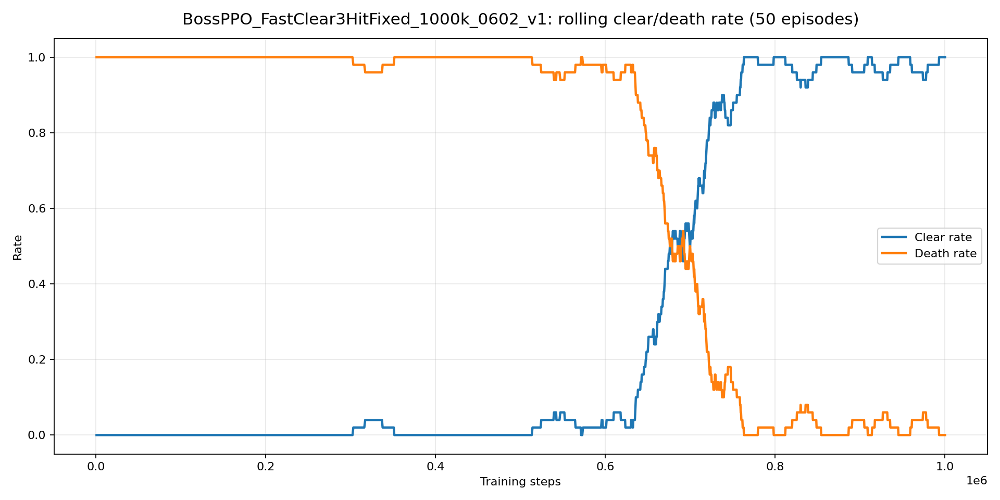
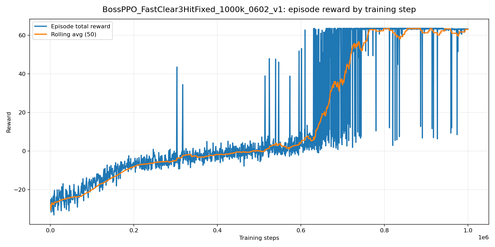
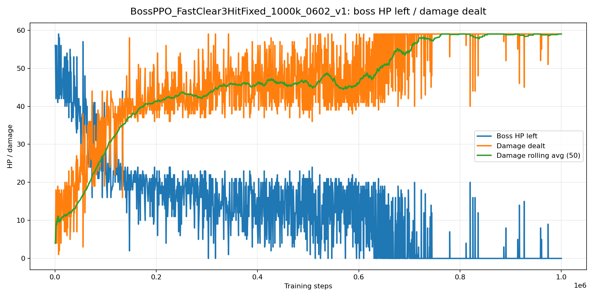
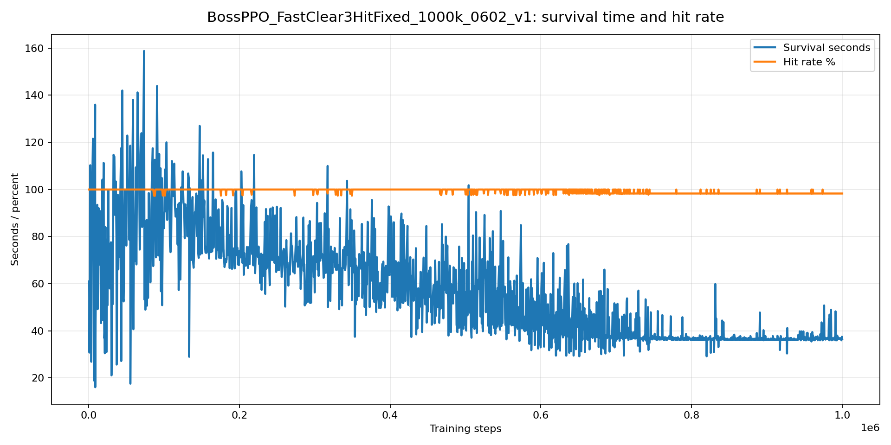
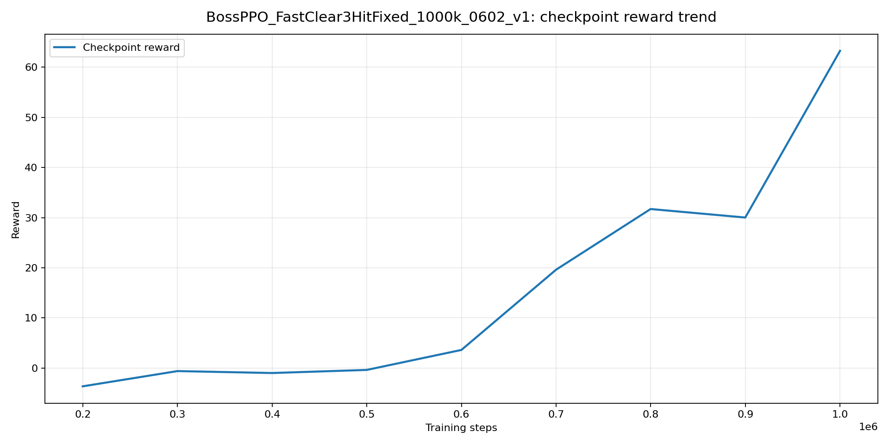
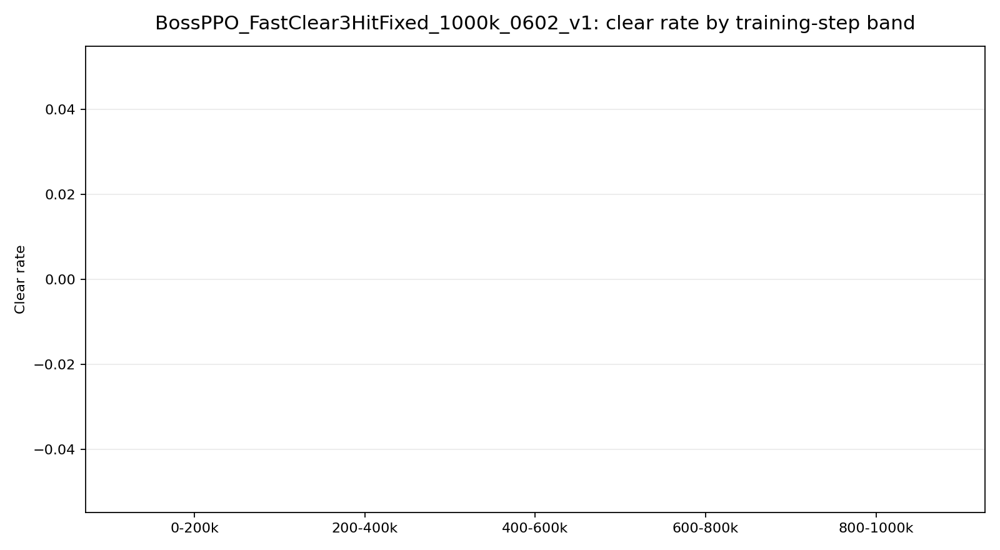
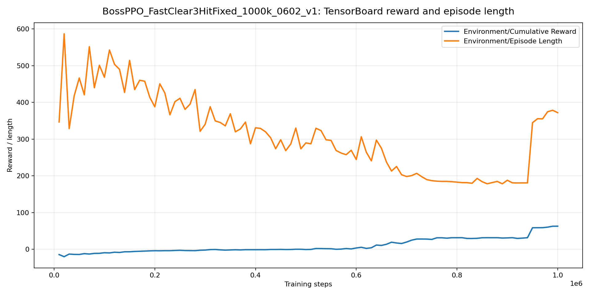
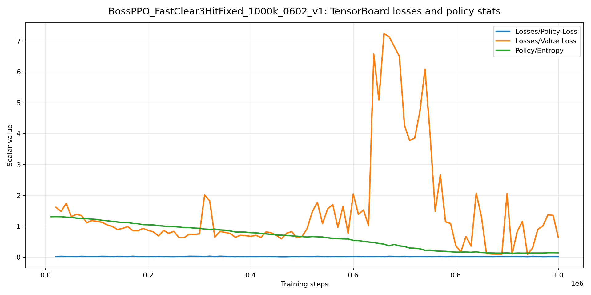

# Training Step Visuals - BossPPO_FastClear3HitFixed_1000k_0602_v1

Generated from:

- `results/BossPPO_FastClear3HitFixed_1000k_0602_v1/run_logs/Player-0.log`
- `results/BossPPO_FastClear3HitFixed_1000k_0602_v1/run_logs/training_status.json`

## Summary

- Total parsed training episodes: 1943
- Clears / deaths / timeouts: 852 / 1091 / 0
- Last 30 training episodes: 30/30 clears, 0/30 deaths
- Last 30 clear rate: 100.0%
- Final checkpoint step: 1,000,040
- Episode-log x-axis: episode action timeline scaled to final checkpoint step for comparison with TensorBoard

## Figures

